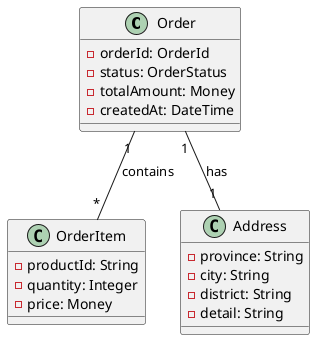

# design-domain Skill 详细设计方案

## 1. 概述

`design-domain` Skill 负责**领域建模 + 表结构设计**，是 AI-Native 开发范式中的核心设计阶段（对应 Phase 2a）。该 Skill 可独立使用，也可作为完整流程的一部分。

## 2. 功能定位

| 维度 | 说明 |
|------|------|
| **阶段定位** | Phase 2a：领域建模 + 表结构设计 |
| **核心职责** | 从 UseCase 和 UI 元素中提取领域模型，设计数据库表结构 |
| **输入来源** | PRD、UseCase 列表、UI Element Tree、Product Map（可选） |
| **输出产物** | 领域模型、物理表结构、自检报告、字段溯源 |

## 3. 输入规范

### 3.1 输入参数

| 参数名 | 类型 | 必填 | 说明 |
|--------|------|------|------|
| `usecase` | JSON/Markdown | 是 | UseCase 列表，包含业务场景描述 |
| `ui_elements` | JSON | 是 | UI Element Tree，页面→区块→字段的层级结构 |
| `product_map` | JSON/YAML | 否 | 现有 Product Map，用于增量设计 |
| `existing_schema` | JSON/SQL | 否 | 现有数据库 Schema，用于增量设计 |
| `tech_stack` | String | 否 | 技术栈选择：java-springboot / node-express / python-fastapi |
| `database` | String | 否 | 数据库类型：mysql / postgresql / sqlite（默认：mysql） |

### 3.2 输入格式示例

#### UseCase 输入格式（Markdown）
```markdown
## UseCase: 创建订单
- **前置条件**: 用户已登录，购物车有商品
- **主流程**: 用户点击结算 → 确认收货地址 → 选择支付方式 → 提交订单
- **业务规则**: 
  - 订单金额必须 ≥ 0
  - 库存不足时无法创建订单
  - 同一用户 5 分钟内不能重复提交相同订单

## UseCase: 查询订单列表
- **前置条件**: 用户已登录
- **主流程**: 用户进入订单页面 → 系统返回订单列表
- **业务规则**: 只能查询自己的订单
```

#### UI Element Tree 输入格式（JSON）
```json
{
  "pages": [
    {
      "pageName": "{页面名称}",
      "blocks": [
        {
          "blockName": "{区块名称}",
          "fields": [
            {"name": "{字段名}", "label": "{标签}", "type": "{类型}", "required": true/false}
          ]
        }
      ]
    }
  ]
}
```

## 4. 输出规范

### 4.1 输出产物清单

| 产物 | 格式 | 用途 |
|------|------|------|
| **领域模型** | Markdown + PlantUML | 展示 Entity/Aggregate/ValueObject/Enum |
| **表结构设计** | SQL DDL + JSON | 物理表定义和字段属性 |
| **自检报告** | JSON/HTML | 3NF 检查、字段覆盖率、完整性校验结果 |
| **字段溯源** | JSON/HTML | 每个字段的来源（UI/业务规则） |
| **变更清单** | Markdown | 相对于现有 Schema 的增量变更 |

### 4.2 输出格式示例

#### 领域模型输出（Markdown + PlantUML）
```markdown
## 领域模型

### Aggregate: Order（订单聚合根）
| 成员 | 类型 | 说明 |
|------|------|------|
| orderId | OrderId (ValueObject) | 订单唯一标识 |
| status | OrderStatus (Enum) | 订单状态 |
| totalAmount | Money (ValueObject) | 订单总金额 |
| items | List\<OrderItem\> | 订单项列表 |
| address | Address (ValueObject) | 收货地址 |
| createdAt | DateTime | 创建时间 |

### ValueObject: Money
| 成员 | 类型 | 说明 |
|------|------|------|
| amount | BigDecimal | 金额数值 |
| currency | String | 货币类型（默认：CNY） |

### Enum: OrderStatus
| 值 | 说明 |
|----|------|
| PENDING_PAYMENT | 待支付 |
| PAID | 已支付 |
| SHIPPED | 已发货 |
| COMPLETED | 已完成 |



#### 表结构设计输出（SQL DDL）
```sql
-- 订单表
CREATE TABLE `order` (
  `id` BIGINT UNSIGNED NOT NULL AUTO_INCREMENT COMMENT '订单ID',
  `order_no` VARCHAR(64) NOT NULL COMMENT '订单编号（唯一）',
  `user_id` BIGINT UNSIGNED NOT NULL COMMENT '用户ID',
  `status` TINYINT NOT NULL DEFAULT 0 COMMENT '订单状态：0-待支付 1-已支付 2-已发货 3-已完成',
  `total_amount` DECIMAL(10,2) NOT NULL COMMENT '订单总金额',
  `currency` VARCHAR(10) NOT NULL DEFAULT 'CNY' COMMENT '货币类型',
  `province` VARCHAR(64) COMMENT '收货省份',
  `city` VARCHAR(64) COMMENT '收货城市',
  `district` VARCHAR(64) COMMENT '收货区县',
  `address_detail` VARCHAR(512) COMMENT '详细地址',
  `created_at` DATETIME NOT NULL DEFAULT CURRENT_TIMESTAMP COMMENT '创建时间',
  `updated_at` DATETIME NOT NULL DEFAULT CURRENT_TIMESTAMP ON UPDATE CURRENT_TIMESTAMP COMMENT '更新时间',
  PRIMARY KEY (`id`),
  UNIQUE KEY `uk_order_no` (`order_no`),
  INDEX `idx_user_id` (`user_id`),
  INDEX `idx_status` (`status`),
  INDEX `idx_created_at` (`created_at`)
) ENGINE=InnoDB DEFAULT CHARSET=utf8mb4 COLLATE=utf8mb4_unicode_ci COMMENT='订单表';

-- 订单项表
CREATE TABLE `order_item` (
  `id` BIGINT UNSIGNED NOT NULL AUTO_INCREMENT COMMENT '订单项ID',
  `order_id` BIGINT UNSIGNED NOT NULL COMMENT '订单ID',
  `product_id` BIGINT UNSIGNED NOT NULL COMMENT '商品ID',
  `quantity` INT NOT NULL DEFAULT 1 COMMENT '数量',
  `unit_price` DECIMAL(10,2) NOT NULL COMMENT '单价',
  `total_price` DECIMAL(10,2) NOT NULL COMMENT '小计',
  PRIMARY KEY (`id`),
  INDEX `idx_order_id` (`order_id`),
  INDEX `idx_product_id` (`product_id`),
  CONSTRAINT `fk_order_item_order` FOREIGN KEY (`order_id`) REFERENCES `order`(`id`) ON DELETE CASCADE
) ENGINE=InnoDB DEFAULT CHARSET=utf8mb4 COLLATE=utf8mb4_unicode_ci COMMENT='订单项表';
```

#### 自检报告输出（JSON）
```json
{
  "summary": {
    "status": "PASS",
    "totalFields": 15,
    "coveredFields": 15,
    "coverageRate": 100,
    "nfLevel": 3
  },
  "checks": [
    {
      "name": "3NF Check",
      "status": "PASS",
      "details": "所有表均满足第三范式"
    },
    {
      "name": "UI Field Coverage",
      "status": "PASS",
      "details": "UI 字段覆盖率：100% (12/12)"
    },
    {
      "name": "Business Rule Coverage",
      "status": "PASS",
      "details": "业务规则覆盖率：100% (3/3)"
    },
    {
      "name": "Nullability Check",
      "status": "WARNING",
      "details": "字段 'address_detail' 允许为空，请确认业务逻辑"
    },
    {
      "name": "Index Recommendation",
      "status": "INFO",
      "details": "建议为 order_no 添加唯一索引（已自动添加）"
    }
  ],
  "warnings": [],
  "errors": []
}
```

#### 字段溯源输出（JSON）
```json
{
  "tables": [
    {
      "tableName": "order",
      "fields": [
        {
          "fieldName": "order_no",
          "source": "UI",
          "uiElement": "订单列表页 > 订单卡片 > 订单编号",
          "businessRule": "订单编号必须唯一"
        },
        {
          "fieldName": "status",
          "source": "UI + BusinessRule",
          "uiElement": "订单列表页 > 订单卡片 > 订单状态",
          "businessRule": "状态流转：待支付→已支付→已发货→已完成"
        },
        {
          "fieldName": "total_amount",
          "source": "UI + BusinessRule",
          "uiElement": "订单列表页 > 订单卡片 > 订单金额",
          "businessRule": "订单金额必须 ≥ 0"
        }
      ]
    }
  ]
}
```

## 5. 核心处理流程

```
┌─────────────────────────────────────────────────────────────────┐
│                     design-domain Skill                         │
├─────────────────────────────────────────────────────────────────┤
│  Step 1: 输入解析                                               │
│    ├── 解析 UseCase → 提取业务实体和规则                          │
│    └── 解析 UI Element Tree → 提取字段定义                        │
├─────────────────────────────────────────────────────────────────┤
│  Step 2: 领域建模                                               │
│    ├── 识别 Entity / Aggregate / ValueObject / Enum              │
│    ├── 建立实体关系（一对一、一对多、多对多）                      │
│    └── 定义业务规则约束                                          │
├─────────────────────────────────────────────────────────────────┤
│  Step 3: 表结构设计                                             │
│    ├── 将领域模型映射为物理表                                     │
│    ├── 设计主键、外键、索引                                      │
│    ├── 处理继承关系（单表/多表策略）                              │
│    └── 生成 SQL DDL                                             │
├─────────────────────────────────────────────────────────────────┤
│  Step 4: 增量更新处理（如果提供了现有 Schema）                      │
│    ├── 对比现有表结构                                            │
│    ├── 生成 ALTER TABLE 语句（新增/修改字段）                      │
│    └── 标记废弃字段（不物理删除）                                  │
├─────────────────────────────────────────────────────────────────┤
│  Step 5: 自检与验证                                             │
│    ├── 3NF 规范化检查                                            │
│    ├── UI 字段覆盖率检查                                         │
│    ├── 业务规则完整性检查                                         │
│    └── 生成自检报告                                              │
├─────────────────────────────────────────────────────────────────┤
│  Step 6: 输出                                                   │
│    ├── 领域模型文档（Markdown + PlantUML）                        │
│    ├── 表结构设计（SQL DDL）                                      │
│    ├── 自检报告（JSON/HTML）                                      │
│    └── 字段溯源报告（JSON/HTML）                                  │
└─────────────────────────────────────────────────────────────────┘
```

## 6. 核心算法与规则

### 6.1 领域模型识别规则

| 识别类型 | 识别规则 | 示例 |
|----------|----------|------|
| **Aggregate Root** | 有独立业务生命周期、可被外部直接引用 | Order（订单） |
| **Entity** | 有唯一标识、生命周期依赖于 Aggregate | OrderItem（订单项） |
| **ValueObject** | 无唯一标识、由属性值组成、不可变 | Money、Address |
| **Enum** | 有限离散值集合、用于状态或类型标识 | OrderStatus |

### 6.2 表结构设计规则

| 规则类型 | 规则描述 |
|----------|----------|
| **主键设计** | 使用 BIGINT UNSIGNED AUTO_INCREMENT |
| **外键设计** | 外键字段命名：`{关联表名}_id`，级联删除 |
| **索引设计** | 外键字段、查询条件字段、排序字段自动建索引 |
| **命名规范** | 表名：小写下划线；字段名：小写下划线 |
| **注释要求** | 每个表和字段必须有中文注释 |

### 6.3 自检规则

| 检查项 | 检查规则 | 判定标准 |
|--------|----------|----------|
| **3NF 检查** | 非主键字段必须完全依赖主键，无传递依赖 | PASS/FAIL |
| **字段覆盖率** | UI 字段必须全部映射到表字段 | ≥95% PASS，<95% WARNING |
| **业务规则覆盖** | UseCase 中的业务规则必须在表结构中体现 | 100% PASS |
| **空值检查** | 必填字段必须 NOT NULL | PASS/WARNING |
| **索引建议** | 根据查询场景推荐索引 | INFO |

## 7. 调用方式

### 7.1 命令行调用
```bash
# 基础调用
design-domain \
  --usecase="usecase.md" \
  --ui_elements="ui_elements.json" \
  --output="./output"

# 带现有 Schema 的增量设计
design-domain \
  --usecase="usecase.md" \
  --ui_elements="ui_elements.json" \
  --existing_schema="existing_schema.sql" \
  --product_map="product-map/" \
  --database="postgresql" \
  --output="./output"
```

### 7.2 API 调用
```json
POST /api/design-domain
Content-Type: application/json

{
  "usecase": "...",
  "ui_elements": {...},
  "product_map": {...},
  "existing_schema": "...",
  "tech_stack": "java-springboot",
  "database": "mysql"
}
```

### 7.3 Skill 调用（Cursor/Trae）
```
/design-domain --usecase="需求文档.md" --ui="设计稿.json" --product-map="./product-map"
```

## 8. 错误处理

### 8.1 输入验证错误

| 错误类型 | 错误码 | 错误消息 |
|----------|--------|----------|
| 缺少必填参数 | 400 | "缺少必填参数：usecase 或 ui_elements" |
| 格式错误 | 400 | "usecase 格式不正确，请使用 Markdown 格式" |
| JSON 解析失败 | 400 | "ui_elements JSON 解析失败：{具体错误}" |

### 8.2 业务逻辑错误

| 错误类型 | 错误码 | 错误消息 |
|----------|--------|----------|
| 字段覆盖率不足 | 400 | "UI 字段覆盖率 {rate}%，低于 95% 阈值" |
| 业务规则冲突 | 400 | "业务规则冲突：{描述}" |
| Schema 对比失败 | 500 | "现有 Schema 解析失败：{具体错误}" |

### 8.3 输出降级策略

当发生非致命错误时，输出降级为：
1. 生成部分结果（可能不完整）
2. 在自检报告中标记 WARNING
3. 提供人工审查建议

## 9. 扩展点

### 9.1 可扩展组件

| 扩展点 | 说明 | 扩展方式 |
|--------|------|----------|
| **数据库方言** | 支持不同数据库类型 | 新增 Dialect 实现 |
| **命名策略** | 表名/字段名命名规则 | 自定义 NamingStrategy |
| **索引策略** | 索引生成规则 | 自定义 IndexStrategy |
| **验证规则** | 自定义校验规则 | 新增 Validator 实现 |

### 9.2 插件机制

```
design-domain/
├── core/           # 核心逻辑
├── dialects/       # 数据库方言插件
│   ├── mysql/
│   ├── postgresql/
│   └── sqlite/
├── strategies/     # 策略插件
│   ├── naming/
│   └── index/
└── validators/     # 校验插件
    ├── 3nf/
    └── coverage/
```

## 10. 性能考虑

### 10.1 处理规模
- 支持最大：100 个 UseCase + 500 个 UI 字段
- 处理时间：< 30 秒（常规场景）

### 10.2 缓存策略
- 缓存 Product Map 解析结果
- 缓存领域模型到表结构的映射规则

## 11. 安全考虑

| 安全风险 | 应对策略 |
|----------|----------|
| SQL 注入 | 参数化输出，禁止拼接 SQL |
| 敏感信息泄露 | 输出前脱敏处理 |
| 资源耗尽 | 限制输入大小（最大 10MB） |

---

## 附录：输出文件清单

| 文件 | 路径 | 说明 |
|------|------|------|
| 领域模型 | `output/domain-model.md` | Markdown 格式的领域模型文档 |
| 领域模型图 | `output/domain-model.puml` | PlantUML 格式的模型图 |
| 表结构 | `output/schema.sql` | SQL DDL 语句 |
| 表结构 JSON | `output/schema.json` | JSON 格式的表结构定义 |
| 自检报告 | `output/self-check.json` | JSON 格式的自检结果 |
| 自检报告 HTML | `output/self-check.html` | 人类可读的自检报告 |
| 字段溯源 | `output/field-trace.json` | JSON 格式的字段溯源 |
| 字段溯源 HTML | `output/field-trace.html` | 可视化的字段溯源 |
| 变更清单 | `output/changelog.md` | Markdown 格式的变更说明 |