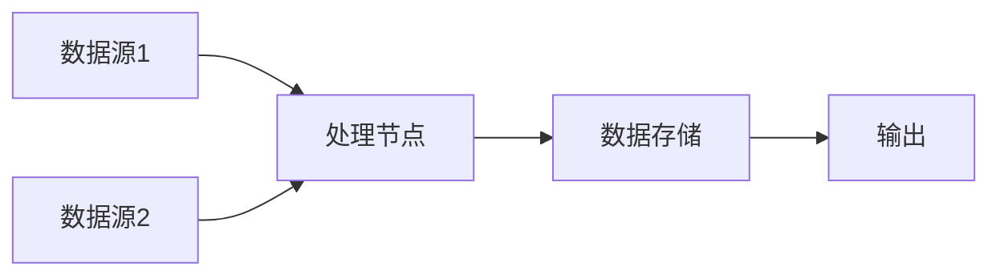
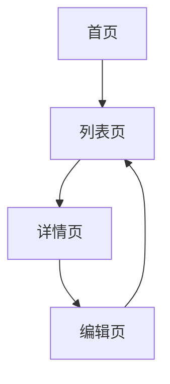
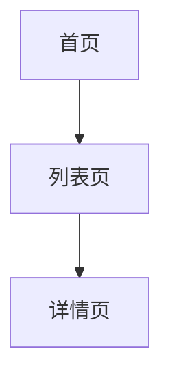

# requirement-split Skill

## 概述

`requirement-split` Skill 负责**需求文档的功能分解与工时预估**，是 AI-Native 开发范式中需求分析阶段的核心工具。该 Skill 采用"大模型拆解 + Python处理"的架构模式。

## 完整处理流程

```
原始需求MD文档 + Figma原型 → 宏观能力分析 → 页面功能映射 → 核心数据流/页面流分析 → 工作包定义（页面+前端+后端一体化） → 与用户交互澄清 → 生成新MD → 拆分工作项 → 生成JSON → Python脚本生成CSV → 验收确认
```

### ⚠️ 严格执行要求

**大模型必须严格按照以下步骤执行，禁止跳过任何步骤！**

| 步骤 | 执行者 | 描述 | 禁止行为 |
|------|--------|------|----------|
| 1 | 用户 | 提供原始需求MD文档 + Figma原型文件/链接 | - |
| 2 | MCP工具 | 调用Figma MCP解析原型，提取页面结构、组件、交互说明 | - |
| 3 | 大模型 | 宏观能力分析：明确迭代要提供的核心能力 | - |
| 4 | 大模型 | 页面功能映射：建立页面与功能的完整对应关系 | - |
| 5 | 大模型 | 分析核心数据流和核心页面流 | - |
| 6 | 大模型 | 工作包定义：将页面、前端交互、后端实现一体化拆解，并进行技术难度和复杂性分析 | - |
| 7 | 大模型+用户 | 识别待澄清问题并与用户交互确认 | ❌ 禁止跳过此步骤 |
| 8 | 大模型 | 根据澄清结果生成**澄清后新MD文件** | ❌ 禁止跳过此步骤 |
| 9 | 大模型 | 对新MD文件进行需求项和工作项拆分，预估后端工时 | ❌ 禁止基于原MD直接生成JSON |
| 10 | 大模型 | 输出结构化JSON文件 | - |
| 11 | Python脚本 | 读取JSON，生成工作计划预估表CSV | - |
| 12 | 大模型 | 自动验收：对分解内容进行自动化验证 | ❌ 禁止跳过此步骤 |

### 流程说明

**核心原则**：前端视角与后端视角融合为**工作包**，每个工作包是一个独立的交付单元。

| 阶段 | 产出 | 用途 |
|------|------|------|
| 宏观能力分析 | 能力清单 | 明确迭代目标 |
| 页面功能映射 | 页面功能对应关系 | 确保无遗漏 |
| 数据流/页面流分析 | 流程图、跳转关系 | 明确数据和页面流向 |
| 工作包定义 | 页面+前端+后端一体化设计 + **技术难度和复杂性分析** | 核心交付单元 + **工时调整依据** |
| 用户澄清 | 澄清后的需求定义 | 确保需求准确 |
| 新MD文档 | 完整需求文档 | 开发参考 |
| JSON输出 | 结构化数据 | Python脚本输入 |
| CSV输出 | 工作计划预估表 | 工时统计、任务分配 |
| 验收确认 | 验收通过/修改意见 | 确保分解准确完整 |

### 验收环节说明

#### 自动化验收内容
大模型在生成CSV后，自动对分解内容进行以下验证：

| 验收项 | 说明 | 验证规则 |
|--------|------|----------|
| 需求项完整性 | 检查所有需求是否都已拆解 | 确认每个能力点都有对应的需求项 |
| 工作项覆盖度 | 检查每个需求项的工作项是否完整 | 每个需求项至少有1个工作项 |
| 工时预估合理性 | 检查工时预估是否符合标准 | 工时值必须在1.0-24小时范围内 |
| 前后端关联 | 检查前端交互与后端接口的关联是否正确 | 每个交互点必须关联到对应的接口 |
| 技术难点识别 | 检查技术难点是否已识别并说明 | 复杂功能必须标注技术难点 |

#### 自动化验收流程
```
大模型自动执行：
1. 检查需求项是否覆盖所有能力点
2. 检查每个需求项是否有工作项
3. 验证工时预估是否符合标准规则
4. 检查前后端关联是否完整
5. 生成验收报告

输出：
- 验收通过：继续流程，输出最终成果
- 验收失败：输出问题清单，终止流程并提示修改
```

#### 验收通过标准
- ✅ 所有需求项均已拆解
- ✅ 工作项覆盖完整，无遗漏
- ✅ 工时预估符合标准规则（1.0-24小时）
- ✅ 前后端关联正确
- ✅ 无错误或警告

### Figma MCP 集成支持

**当用户提供 Figma 原型时，大模型应调用 Figma MCP 工具进行以下操作：**

| 操作 | 描述 | 提取内容 |
|------|------|----------|
| 获取页面结构 | 解析 Figma 文件的页面层级 | 页面名称、页面顺序、页面分组 |
| 提取组件信息 | 分析页面中的组件 | 组件名称、组件类型、组件属性 |
| 获取交互说明 | 解析原型中的交互流程 | 点击事件、导航跳转、状态变化 |
| 提取文本内容 | 提取页面中的文字信息 | 按钮文案、标题、提示信息 |
| 获取布局信息 | 分析页面布局结构 | 列表、表单、弹窗等布局模式 |

**Figma 解析结果应用于：**
1. **页面流向分析**：根据原型中的页面导航关系，补充新MD中的页面流向表格
2. **功能需求细化**：根据组件和交互，细化需求描述和业务规则
3. **接口设计参考**：根据表单字段、列表展示等，推导后端接口设计
4. **数据流向分析**：根据页面间数据传递，分析数据流向

### 使用方式

#### 方式一：仅提供需求MD文档
```
用户："我有一个需求文档，请帮我分析并拆分需求。"
用户：[上传需求文档.md]

Skill：
1. 阅读需求文档
2. 宏观能力分析：明确迭代核心能力
3. 页面功能映射：建立页面与功能对应关系
4. 分析核心数据流和页面流
5. 前端视角需求拆解：从页面视角拆分功能需求
6. 后端视角实现方案：分解核心逻辑、技术难点
7. 识别待澄清问题并与用户确认
8. 生成澄清后新MD文件
9. 拆分需求项和工作项，预估工时
10. 生成JSON文件
11. 调用Python脚本生成work-plan.csv
```

#### 方式二：提供需求MD文档 + Figma原型（推荐）
```
用户："我有一个需求文档和Figma原型，请帮我分析并拆分需求。"
用户：[上传需求文档.md]
用户：[提供Figma文件或链接]

Skill：
1. 调用Figma MCP解析原型，提取页面结构、组件、交互等信息
2. 宏观能力分析：基于原型明确迭代核心能力
3. 页面功能映射：建立页面与功能的完整对应关系（无遗漏）
4. 分析核心数据流和页面流
5. 前端视角需求拆解：从页面视角拆分功能需求定义
6. 后端视角实现方案：分解核心逻辑、技术难点、约束
7. 识别待澄清问题并与用户确认
8. 生成澄清后新MD文件（包含完整的需求定义）
9. 拆分需求项和工作项，预估后端工时
10. 生成JSON文件
11. 调用Python脚本生成work-plan.csv
```

#### 预期交互示例
```
Skill："我已分析需求文档和Figma原型，有以下问题需要确认：
1. 用户列表页面的搜索功能是否需要支持模糊匹配？
2. 订单详情页的支付状态变更是否需要实时刷新？
3. 第三方API调用失败时是否需要重试机制？

请逐一回答以上问题。"

用户："1. 需要支持模糊匹配；2. 需要实时刷新；3. 需要重试3次。"

Skill："已收到你的回答，现在生成澄清后新MD文档..."
```

#### 输出产物说明
| 产物 | 格式 | 用途 |
|------|------|------|
| 澄清后新MD文档 | Markdown | 包含宏观能力、页面映射、数据流、前端需求、后端方案 |
| 结构化JSON | JSON | 包含需求项、工作项、工时预估 |
| 工作计划预估表 | CSV | 需求项、工作项、预计后端工时、说明 |

### 澄清后新MD文件格式

生成新MD文件时，必须包含以下详细结构：

```markdown
# [需求名称]

## 一、宏观能力分析
### 1.1 迭代核心能力概述
[描述本迭代要提供的核心能力，从宏观角度说明价值]

### 1.2 能力清单
| 能力编号 | 能力名称 | 能力描述 | 优先级 |
|----------|----------|----------|--------|
| C001 | [能力名] | [描述] | P0/P1/P2 |
| C002 | [能力名] | [描述] | P0/P1/P2 |

## 二、页面功能映射
### 2.1 页面清单
| 页面编号 | 页面名称 | 页面路径 | 功能描述 |
|----------|----------|----------|----------|
| P001 | [页面名] | /path | [描述] |

### 2.2 页面功能对应关系
| 页面 | 功能点 | 关联能力 | 状态 |
|------|--------|----------|------|
| P001 | [功能1] | C001 | 新增/修改/删除 |
| P001 | [功能2] | C002 | 新增/修改/删除 |

## 三、核心数据流分析
### 3.1 数据流图


### 3.2 数据流详情
| 数据项 | 来源 | 流向 | 格式 | 说明 |
|--------|------|------|------|------|
| [数据] | [来源] | [目标] | [格式] | [说明] |

## 四、核心页面流分析
### 4.1 页面流程图


### 4.2 页面跳转关系
| 起点页面 | 操作 | 终点页面 | 参数传递 |
|----------|------|----------|----------|
| [页面A] | [操作] | [页面B] | [参数] |

## 五、工作包定义（页面+前端+后端一体化）

### 5.1 [工作包名称：页面/功能模块]
#### 5.1.1 工作包概述
[描述该工作包的核心功能、业务价值、关联能力]

**关联能力**：C001、C002  
**关联页面**：P001  
**优先级**：P0/P1/P2  
**状态**：新增/修改/优化

---

#### 5.1.2 页面与前端视角
##### 交互需求
| 交互点 | 触发方式 | 预期行为 | 边界条件 | 关联后端接口 |
|--------|----------|----------|----------|--------------|
| [交互1] | 点击/输入/滚动 | [行为描述] | [边界条件] | [接口ID] |
| [交互2] | 点击/输入/滚动 | [行为描述] | [边界条件] | [接口ID] |

##### UI组件需求
| 组件名称 | 类型 | 功能说明 | 状态 | 数据来源 |
|----------|------|----------|------|----------|
| [组件1] | 按钮/表单/列表/弹窗 | [功能描述] | 新增/复用 | [API/状态管理] |
| [组件2] | 按钮/表单/列表/弹窗 | [功能描述] | 新增/复用 | [API/状态管理] |

##### 数据展示需求
| 数据字段 | 展示格式 | 来源接口 | 更新频率 | 后端字段映射 |
|----------|----------|----------|----------|--------------|
| [字段1] | [格式] | [接口路径] | [频率] | [后端字段] |
| [字段2] | [格式] | [接口路径] | [频率] | [后端字段] |

---

#### 5.1.3 后端实现方案
##### 核心业务逻辑
[描述核心逻辑处理流程、数据流转、业务规则]

##### 接口设计
| 接口ID | 接口路径 | HTTP方法 | 请求体 | 响应体 | 功能描述 | 关联交互 |
|--------|----------|----------|--------|--------|----------|----------|
| API001 | /api/xxx | GET/POST | {...} | {...} | [描述] | [交互1] |
| API002 | /api/yyy | GET/POST | {...} | {...} | [描述] | [交互2] |

##### 数据库设计
| 表名 | 字段名 | 类型 | 约束 | 说明 | 关联前端字段 |
|------|--------|------|------|------|--------------|
| [表名] | [字段] | [类型] | [约束] | [说明] | [前端字段] |

##### 技术难点与约束
| 难点编号 | 描述 | 影响范围 | 解决方案 | 预估工时影响 |
|----------|------|----------|----------|--------------|
| D001 | [难点描述] | [影响范围] | [解决方案] | +X小时 |

##### 外部依赖
| 依赖名称 | 类型 | 版本 | 用途 | 可靠性评估 |
|----------|------|------|------|------------|
| [依赖] | API/SDK | [版本] | [用途] | 高/中/低 |

---

#### 5.1.4 技术难度和复杂性分析
##### 技术难度评估
| 评估维度 | 难度等级 | 说明 | 工时影响 |
|----------|----------|------|----------|
| 业务逻辑复杂度 | 简单/中等/复杂 | [描述业务逻辑的复杂程度] | +0/+1/+2小时 |
| 数据处理复杂度 | 简单/中等/复杂 | [描述数据处理的复杂程度] | +0/+1/+2小时 |
| 接口集成复杂度 | 简单/中等/复杂 | [描述外部接口集成的复杂程度] | +0/+2/+4小时 |
| 性能要求复杂度 | 简单/中等/复杂 | [描述性能优化要求的复杂程度] | +0/+1/+3小时 |
| 安全性复杂度 | 简单/中等/复杂 | [描述安全要求的复杂程度] | +0/+1/+2小时 |

##### 复杂性因素清单
| 因素编号 | 因素描述 | 影响程度 | 应对策略 |
|----------|----------|----------|----------|
| F001 | [因素描述] | 高/中/低 | [应对策略] |
| F002 | [因素描述] | 高/中/低 | [应对策略] |

##### 工时调整建议
基于技术难度和复杂性分析，建议工时调整：
- 基础工时：[X小时]
- 难度调整：+[X小时]
- 复杂性调整：+[X小时]
- **建议总工时：[X小时]**

---

#### 5.1.5 工作项拆解与工时预估
| 序号 | 工作项 | 类型 | 预估工时（小时） | 说明 |
|------|--------|------|------------------|------|
| 1 | [工作项1] | 接口开发/逻辑开发/数据设计 | [工时] | [说明] |
| 2 | [工作项2] | 接口开发/逻辑开发/数据设计 | [工时] | [说明] |
| 3 | [工作项3] | 接口开发/逻辑开发/数据设计 | [工时] | [说明] |
| --- | 小计 | - | [合计] | - |

## 七、需求项与工作项汇总

### 7.1 需求项清单
| 需求项 | 描述 | 关联页面 | 后端工时预估 |
|--------|------|----------|--------------|
| [需求] | [描述] | P001 | [工时] |

### 7.2 工作项拆解
| 需求项 | 工作项 | 类型 | 工时预估（小时） | 说明 |
|--------|--------|------|------------------|------|
| [需求] | [工作项] | 接口/逻辑/数据 | [工时] | [说明] |

## 八、非功能需求
- 性能要求：[描述]
- 安全要求：[描述]
- 兼容性要求：[描述]

## 九、边界说明
[本需求不包括的范围，明确排除项]
```

**重要**：
- 新MD文件是基于澄清后的完整需求文档
- JSON输出必须基于此新MD文档生成
- 不能基于原始需求文档直接生成JSON
- 必须包含宏观能力分析、页面功能映射、数据流、页面流、前端视角、后端视角等完整信息

## 功能定位

| 维度 | 说明 |
|------|------|
| **阶段定位** | 需求分析阶段 |
| **核心职责** | 解析需求文档，拆分为需求项和工作项，生成工时预估表 |
| **输入来源** | 大模型输出的结构化 JSON 结果 |
| **输出产物** | 工作计划预估表（CSV格式） |

## 分解粒度标准

### 需求项粒度

**定义**：一个完整的功能级别的闭环，代表一个独立的业务功能模块或用户故事。

**粒度标准**：
- 需求项应是一个**可交付的功能单元**
- 具有明确的**业务价值**和**边界**
- 可以独立进行开发、测试和验收
- 通常对应一个**用户故事**或**业务场景**

**示例**：
- ✅ 订单管理
- ✅ 用户注册登录
- ✅ 商品搜索
- ✅ 购物车管理
- ✅ AI智能推荐

### 工作项粒度

**定义**：对需求项的下一层级拆解，**工作项是功能/模块级别的概念**，不是页面级别，也不是接口级别。

**粒度标准**：
- 工作项应是一个**功能模块或独立功能点**
- 通常对应一个**卡片组件**、**交互功能**或**业务逻辑模块**
- 可以独立进行工作量估算
- 工时预估基于该功能包含的接口数量、复杂度、逻辑难度等综合判断

**示例**（参考截图）：
| 需求项 | 工作项（功能/模块级） |
|--------|----------------------|
| 推荐卡片展示信息内容优化 | 舌象结果卡优化 |
| 推荐卡片展示信息内容优化 | 体质结果卡优化 |
| 推荐卡片展示信息内容优化 | 食疗结果卡优化 |
| 推荐卡片新增 | 调理方案推荐卡 |
| 推荐卡片新增 | 调理启动卡（支付后启动前） |
| 报告页调理方案入口 | 食疗/舌象报告底部调理入口 |
| 生成调理方案 | 根据食疗生成调理方案 |
| 生成调理方案 | 根据舌象生成调理方案 |
| 下单付款支付闭环 | 商品管理（纯后端代码） |
| 下单付款支付闭环 | 地址管理/添加、选择地址页 |

**工作项类型**：
| 类型 | 说明 | 示例 |
|------|------|------|
| 页面开发 | 完整页面的前端+后端开发 | 用户列表页面、订单详情页面 |
| 功能模块 | 独立功能模块开发 | 支付模块、推荐模块 |
| 弹窗组件 | 弹窗或模态框开发 | 登录弹窗、确认弹窗 |
| 数据同步 | 数据同步或批处理任务 | 报表数据同步、定时任务 |

**示例**（参考截图）：
| 需求项 | 工作项（页面/功能级） |
|--------|----------------------|
| 推荐卡片展示信息内容优化 | 对话推荐问答 |
| 推荐卡片展示信息内容优化 | 舌象结果卡优化 |
| 推荐卡片展示信息内容优化 | 体质结果卡优化 |
| 推荐卡片新增 | 调理方案推荐卡 |
| 推荐卡片新增 | 调理启动卡（支付后启动） |
| 报告调理方案入口 | 食疗/舌象报告底部调理入口 |
| 生成调理方案 | 根据食疗生成调理方案 |
| 生成调理方案 | 根据舌象生成调理方案 |
| 下单付款支付闭环 | 商品管理（核销码/编码） |
| 下单付款支付闭环 | 地址管理/添加、选择地址 |
| 调理计划及过程记录 | 今日调理计划 |
| 调理计划及过程记录 | 阶段报告 |

**工时预估方式**：
虽然工作项是页面/功能级别，但**前端工时和后端工时需要分开计算**：

**后端工时计算因素**：
1. 页面内包含的后端接口数量
2. 每个接口的复杂度（简单接口/带表结构/带Mock/调用下游）
3. 核心业务逻辑的复杂度
4. 技术难点和外部依赖（如AI/Dify接口调用）

**前端工时计算因素**：
1. 页面类型（简单页面/表单页面/列表页面/复杂组件）
2. 交互复杂度（表单验证、状态管理、动画效果）
3. 响应式适配需求
4. API数据对接数量

**计算公式**：
- **后端工时** = Σ(各接口工时) + 逻辑复杂度调整
- **前端工时** = 页面基础工时 + 交互复杂度调整 + 适配调整

**示例**：
| 工作项 | 后端工时（小时） | 前端工时（小时） | 说明 |
|--------|------------------|------------------|------|
| 对话推荐问答 | 4.0 | 3.0 | 后端调用Dify接口(4h)，前端复杂交互组件(3h) |
| 舌象结果卡优化 | 1.5 | 2.0 | 后端表结构设计+接口(1.5h)，前端卡片组件(2h) |
| 今日调理计划 | 1.0 | 3.0 | 后端简单接口(1h)，前端列表页面(3h) |

### 分解原则

| 原则 | 说明 |
|------|------|
| **单一职责** | 每个工作项只负责一个具体功能 |
| **可测试性** | 工作项应具有明确的输入输出，便于测试 |
| **独立性** | 工作项之间应尽量减少耦合 |
| **可估算性** | 工作项的工时应在合理范围内（0.5-4小时） |

## 输入规范

### 输入参数

| 参数名 | 类型 | 必填 | 说明 |
|--------|------|------|------|
| `input` | String/File | 是 | 大模型输出的JSON文件路径或JSON字符串 |
| `output` | String | 否 | 输出目录路径（默认：./output） |
| `is-string` | Boolean | 否 | 输入是否为JSON字符串（默认：false） |

### 输入格式（大模型输出的JSON格式）

```json
{
  "requirements": [
    {
      "name": "需求项名称",
      "description": "需求描述",
      "func_type": "新增/修改/删除",
      "work_items": [
        {
          "name": "页面名称或功能模块名称",
          "type": "页面开发/功能模块/弹窗组件",
          "level": "page",
          "backend_hours": 后端合计工时（数字）,
          "frontend_hours": 前端合计工时（数字）,
          "description": "该页面/功能的说明",
          "children": [
            {
              "name": "接口或逻辑名称",
              "type": "接口开发/逻辑开发/数据设计",
              "level": "interface",
              "backend_hours": 后端工时（数字）,
              "frontend_hours": 前端工时（数字）,
              "description": "接口或逻辑说明"
            }
          ]
        }
      ],
      "notes": "注意点",
      "explanation": "澄清后的说明信息",
      "clarifications": []
    }
  ],
  "business_rules": ["业务规则1", "业务规则2"]
}
```

**字段说明**：
- `type`：工作项类型，包括：页面开发、功能模块、弹窗组件、接口开发、逻辑开发、数据设计
- `level`：工作项级别，`page` 表示页面/功能级别，`interface` 表示接口/逻辑级别
- `backend_hours`：后端工时（页面级为合计工时，接口级为单独工时）
- `frontend_hours`：前端工时（页面级为合计工时，接口级为单独工时）
- `children`：子工作项数组，包含该页面/功能下的接口级工作项

**父子关系说明**：
- **父级（level="page"）**：页面/功能级别，包含合计的后端和前端工时
- **子级（level="interface"）**：接口/逻辑级别，包含具体的接口和逻辑实现，通过 `children` 字段关联到父级
- 页面级的工时应为其所有子级工时的总和

**说明**：
- 大模型输出父子结构的工作项
- Python脚本生成CSV时，只处理 `level="page"` 的工作项，使用其合计工时

### 工时预估规则（大模型参考）

#### 后端工时预估规则

| 工作类型 | 预估工时 | 说明 |
|----------|----------|------|
| 简单接口 | 1.0 小时 | 无表结构设计，仅简单CRUD操作 |
| 带表结构设计 | 1.5 小时 | 需要设计表结构的接口开发 |
| 带字段Mock设计 | 2.0 小时 | 需要设计并生成Mock数据 |
| 调用下游接口+Mock | 4.0 小时 | 需要对接外部服务并mock数据 |
| 复杂逻辑功能 | 2.0 × N 小时 | N为复杂度倍数 |

#### 前端工时预估规则

| 工作类型 | 预估工时 | 说明 |
|----------|----------|------|
| 简单页面 | 2.0 小时 | 基础页面结构，少量组件，无复杂交互 |
| 表单页面 | 3.0 小时 | 包含表单验证、字段联动、数据提交 |
| 列表/表格页 | 3.0 小时 | 包含分页、排序、筛选、状态切换 |
| 弹窗/模态框 | 1.0 小时 | 标准弹窗，含表单或信息展示 |
| 复杂交互组件 | 4.0 小时 | 复杂图表、拖拽排序、实时协作等 |
| 动画/动效开发 | 2.0 × N 小时 | N为复杂度倍数（简单动效N=1，复杂动效N=2-3） |
| 状态管理集成 | 1.5 小时 | 接入Redux/Vuex/Pinia等状态管理 |
| API数据对接 | 1.0 小时 | 单个接口对接，含数据处理和异常处理 |
| 页面布局调整 | 1.0 小时 | 已有页面的布局调整和样式优化 |
| 响应式适配 | 2.0 小时 | 适配移动端、平板等多端展示 |

**说明**：工时分为前端和后端两部分，分别估算。

## 输出规范

### 输出产物

| 文件名 | 格式 | 用途 |
|--------|------|------|
| `clarified-requirement.md` | Markdown | 澄清后的需求文档（固定文件名） |
| `requirement-split.json` | JSON | 需求拆分结果JSON（固定文件名） |
| `work-plan.csv` | CSV | 工作计划预估表（固定文件名） |

### 文件名约定

**重要**：所有输出文件名保持固定，不会随输入内容变化：

1. **澄清后的需求文档**：`clarified-requirement.md`
   - 包含完整的需求分析、工作包定义、技术难度分析等内容
   
2. **需求拆分JSON**：`requirement-split.json`
   - 包含结构化的需求项和工作项数据
   - 作为Python脚本的输入

3. **工作计划预估表**：`work-plan.csv`
   - 包含需求项、工作项、前后端工时等信息

### 输出目录结构

```
output/
├── clarified-requirement.md    # 澄清后的需求文档
├── requirement-split.json      # 需求拆分结果JSON
└── work-plan.csv               # 工作计划预估表
```

### 输出流程

```
大模型生成 → clarified-requirement.md → 生成 → requirement-split.json → Python脚本处理 → work-plan.csv
```

## 大模型提示词模板

### 第一步：识别待澄清问题并与用户交互

```
你是一个资深的需求分析专家，请帮我分析以下需求文档。

需求文档内容：
{requirement_doc}

请先阅读并分析这个需求文档，识别出所有需要澄清的问题。
在识别问题后，请逐一与用户确认这些问题的答案。

识别问题示例：
- 业务规则不明确
- 边界条件未定义
- 数据格式或接口规范不确定
- 技术实现方式需要确认

与用户交互时，请清晰描述每个问题，等待用户回答后再继续。
```

### 第二步：生成澄清后新MD文件

```
根据用户的澄清回答，请生成一份**详细完整**的澄清后新MD需求文档。

**重要要求**：必须按照"宏观能力分析 → 页面功能映射 → 核心数据流/页面流 → 工作包定义（页面+前端+后端一体化）"的顺序进行，确保需求分解全面准确。

# [需求名称]

## 一、宏观能力分析
### 1.1 迭代核心能力概述
[描述本迭代要提供的核心能力，从宏观角度说明价值]

### 1.2 能力清单
| 能力编号 | 能力名称 | 能力描述 | 优先级 |
|----------|----------|----------|--------|
| C001 | [能力名] | [描述] | P0/P1/P2 |

## 二、页面功能映射
### 2.1 页面清单
| 页面编号 | 页面名称 | 页面路径 | 功能描述 |
|----------|----------|----------|----------|
| P001 | [页面名] | /path | [描述] |

### 2.2 页面功能对应关系
| 页面 | 功能点 | 关联能力 | 状态 |
|------|--------|----------|------|
| P001 | [功能1] | C001 | 新增/修改/删除 |

## 三、核心数据流分析
### 3.1 数据流图


### 3.2 数据流详情
| 数据项 | 来源 | 流向 | 格式 | 说明 |
|--------|------|------|------|------|
| [数据] | [来源] | [目标] | [格式] | [说明] |

## 四、核心页面流分析
### 4.1 页面流程图


### 4.2 页面跳转关系
| 起点页面 | 操作 | 终点页面 | 参数传递 |
|----------|------|----------|----------|
| [页面A] | [操作] | [页面B] | [参数] |

## 五、工作包定义（页面+前端+后端一体化）

### 5.1 [工作包名称]
#### 5.1.1 工作包概述
[描述核心功能、业务价值]
**关联能力**：C001  
**关联页面**：P001  
**优先级**：P0  

##### 页面与前端视角
| 交互点 | 触发方式 | 预期行为 | 关联接口 |
|--------|----------|----------|----------|
| [交互1] | 点击 | [行为] | API001 |

| 组件名称 | 类型 | 数据来源 |
|----------|------|----------|
| [组件1] | 列表 | API001 |

##### 后端实现方案
| 接口ID | 路径 | 方法 | 功能描述 | 关联交互 |
|--------|------|------|----------|----------|
| API001 | /api/xxx | GET | [描述] | [交互1] |

##### 技术难度和复杂性分析
| 评估维度 | 难度等级 | 说明 | 工时影响 |
|----------|----------|------|----------|
| 业务逻辑复杂度 | 简单/中等/复杂 | [描述] | +0/+1/+2 |
| 数据处理复杂度 | 简单/中等/复杂 | [描述] | +0/+1/+2 |
| 接口集成复杂度 | 简单/中等/复杂 | [描述] | +0/+2/+4 |

##### 工时调整建议
- 基础工时：[X小时]
- 难度调整：+[X小时]
- **建议总工时：[X小时]**

##### 工作项拆解与工时
| 工作项 | 类型 | 工时（小时） | 说明 |
|--------|------|--------------|------|
| [工作项1] | 接口开发 | 1.0 | [说明] |

## 六、需求项与工作项汇总
## 七、非功能需求
## 八、边界说明

请将新MD文档保存到文件中。
```

### 第三步：基于新MD文档生成JSON

```
请基于刚才生成的澄清后新MD文档，进行需求项和工作项拆分，并按以下JSON格式输出：

**⚠️ 强制规则（必须严格遵守）**：
1. **工作项是功能/模块级别的概念**，不是页面级别，也不是接口级别
2. 每个工作项对应一个**功能模块**、**卡片组件**或**独立功能点**
3. 工时预估是该功能的**总计工时**，需要综合计算其包含的所有接口、逻辑、组件的工时
4. 前端工时和后端工时需要分开计算
5. **禁止输出页面名称、接口开发、逻辑开发等工作项**，只输出功能/模块级工作项

**正确示例**（参考截图）：
| 需求项 | 工作项（功能/模块级） |
|--------|----------------------|
| 推荐卡片展示信息内容优化 | 舌象结果卡优化 |
| 推荐卡片展示信息内容优化 | 体质结果卡优化 |
| 推荐卡片新增 | 调理方案推荐卡 |
| 报告页调理方案入口 | 食疗/舌象报告底部调理入口 |
| 生成调理方案 | 根据食疗生成调理方案 |

**错误示例**：
- ❌ "食疗调理方向页"（页面级 - 错误）
- ❌ "报告详情接口"（接口级 - 错误）
- ❌ "入口判断逻辑"（逻辑级 - 错误）

{
  "requirements": [
    {
      "name": "需求项名称",
      "description": "需求描述",
      "func_type": "新增/修改/删除",
      "work_items": [
        {
          "name": "页面名称或功能模块名称",
          "type": "页面开发/功能模块/弹窗组件",
          "backend_hours": 该页面所有后端工作的总工时（数字）,
          "frontend_hours": 该页面所有前端工作的总工时（数字）,
          "description": "该页面/功能的说明，包含主要功能点"
        }
      ],
      "notes": "注意点",
      "explanation": "澄清后的详细说明",
      "clarifications": []
    }
  ],
  "business_rules": ["业务规则1", "业务规则2"]
}

**输出示例**：
{
  "requirements": [
    {
      "name": "食疗调理方向页优化",
      "description": "优化食疗调理方向页面，承接食疗测试结果，引导咨询或生成方案",
      "func_type": "优化",
      "work_items": [
        {
          "name": "食疗调理方向页",
          "type": "页面开发",
          "backend_hours": 3.5,
          "frontend_hours": 2.0,
          "description": "包含食疗结果展示、入口判断、跳转对话/生成方案功能"
        }
      ],
      "notes": "需要区分外部投放和内部入口",
      "explanation": "优化食疗调理方向页面，外部投放入口显示单个按钮，内部入口显示两个按钮",
      "clarifications": []
    }
  ]
}

工时预估规则：

**后端工时计算**：
- 简单接口：1.0小时
- 带表结构设计：1.5小时
- 带字段Mock设计：2.0小时
- 调用下游接口（AI/Dify等）+ Mock数据：4.0小时
- 复杂逻辑功能：根据复杂度估算（2.0 × N）
- 后端工时 = Σ(该页面所有接口工时) + 逻辑复杂度调整

**前端工时计算**：
- 简单页面：2.0小时
- 表单页面：3.0小时
- 列表/表格页：3.0小时
- 弹窗/模态框：1.0小时
- 复杂交互组件：4.0小时
- 动画/动效开发：2.0 × N小时（N为复杂度倍数）
- 状态管理集成：1.5小时
- API数据对接：1.0小时
- 页面布局调整：1.0小时
- 响应式适配：2.0小时

**重要**：JSON必须基于澄清后的新MD文档生成，禁止基于原始需求文档直接生成。
```

## 目录结构

```
requirement-split/
├── SKILL.md                    # 技能描述文件
├── scripts/                    # 脚本目录
│   └── requirement_split.py    # 核心处理脚本
├── tests/                      # 测试目录
│   └── test_requirement_split.py
├── assets/                     # 资源目录
└── samples/                    # 示例文件
    └── sample_output.json
```

## 调用方式

### 命令行调用

```bash
python scripts/requirement_split.py --input="llm_output.json" --output="./output"
```

## 错误处理

| 错误类型 | 错误码 | 错误消息 |
|----------|--------|----------|
| 缺少必填参数 | 400 | "缺少必填参数：input" |
| 文件不存在 | 400 | "输入文件不存在" |
| JSON格式错误 | 400 | "JSON格式解析失败" |

## 版本历史

| 版本 | 日期 | 变更内容 |
|------|------|----------|
| 1.0.0 | 2026-06-12 | 初始版本 |