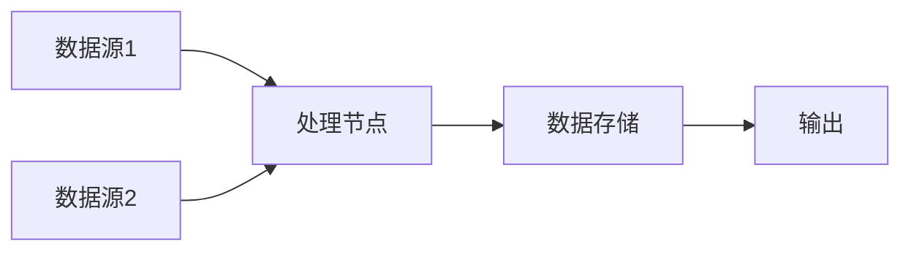
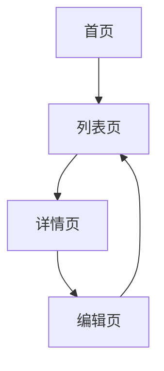

# 澄清后新MD文档格式模板

生成 `clarified-requirement.md` 时必须使用以下模板结构。

## 完整模板（推荐）

```markdown
# [需求名称]

## 一、宏观能力分析
### 1.1 迭代核心能力概述
[描述本迭代要提供的核心能力，从宏观角度说明价值]

### 1.2 能力清单
| 能力编号 | 能力名称 | 能力描述 | 优先级 |
|----------|----------|----------|--------|
| C001 | [能力名] | [描述] | P0/P1/P2 |
| C002 | [能力名] | [描述] | P0/P1/P2 |

## 二、页面功能映射
### 2.1 页面清单
| 页面编号 | 页面名称 | 页面路径 | 功能描述 |
|----------|----------|----------|----------|
| P001 | [页面名] | /path | [描述] |

### 2.2 页面功能对应关系
| 页面 | 功能点 | 关联能力 | 状态 |
|------|--------|----------|------|
| P001 | [功能1] | C001 | 新增/修改/优化 |
| P001 | [功能2] | C002 | 新增/修改/优化 |

## 三、核心数据流分析
### 3.1 数据流图


### 3.2 数据流详情
| 数据项 | 来源 | 流向 | 格式 | 说明 |
|--------|------|------|------|------|
| [数据] | [来源] | [目标] | [格式] | [说明] |

## 四、核心页面流分析
### 4.1 页面流程图


### 4.2 页面跳转关系
| 起点页面 | 操作 | 终点页面 | 参数传递 |
|----------|------|----------|----------|
| [页面A] | [操作] | [页面B] | [参数] |

## 五、工作包定义（页面+前端+后端一体化）

### 5.1 [工作包名称：页面/功能模块]
#### 5.1.1 工作包概述
[描述该工作包的核心功能、业务价值、关联能力]

**关联能力**：C001、C002  
**关联页面**：P001  
**优先级**：P0/P1/P2  
**状态**：新增/修改/优化

---

#### 5.1.2 页面与前端视角
##### 交互需求
| 交互点 | 触发方式 | 预期行为 | 边界条件 | 关联后端接口 |
|--------|----------|----------|----------|--------------|
| [交互1] | 点击/输入/滚动 | [行为描述] | [边界条件] | [接口ID] |
| [交互2] | 点击/输入/滚动 | [行为描述] | [边界条件] | [接口ID] |

##### UI组件需求
| 组件名称 | 类型 | 功能说明 | 状态 | 数据来源 |
|----------|------|----------|------|----------|
| [组件1] | 按钮/表单/列表/弹窗 | [功能描述] | 新增/复用 | [API/状态管理] |
| [组件2] | 按钮/表单/列表/弹窗 | [功能描述] | 新增/复用 | [API/状态管理] |

##### 数据展示需求
| 数据字段 | 展示格式 | 来源接口 | 更新频率 | 后端字段映射 |
|----------|----------|----------|----------|--------------|
| [字段1] | [格式] | [接口路径] | [频率] | [后端字段] |
| [字段2] | [格式] | [接口路径] | [频率] | [后端字段] |

---

#### 5.1.3 后端实现方案
##### 核心业务逻辑
[描述核心逻辑处理流程、数据流转、业务规则]

##### 接口设计
| 接口ID | 接口路径 | HTTP方法 | 请求体 | 响应体 | 功能描述 | 关联交互 |
|--------|----------|----------|--------|--------|----------|----------|
| API001 | /api/xxx | GET/POST | {...} | {...} | [描述] | [交互1] |
| API002 | /api/yyy | GET/POST | {...} | {...} | [描述] | [交互2] |

##### 数据库设计
| 表名 | 字段名 | 类型 | 约束 | 说明 | 关联前端字段 |
|------|--------|------|------|------|--------------|
| [表名] | [字段] | [类型] | [约束] | [说明] | [前端字段] |

##### 技术难点与约束
| 难点编号 | 描述 | 影响范围 | 解决方案 | 预估工时影响 |
|----------|------|----------|----------|--------------|
| D001 | [难点描述] | [影响范围] | [解决方案] | +X小时 |

##### 外部依赖
| 依赖名称 | 类型 | 版本 | 用途 | 可靠性评估 |
|----------|------|------|------|------------|
| [依赖] | API/SDK | [版本] | [用途] | 高/中/低 |

---

#### 5.1.4 技术难度和复杂性分析
##### 技术难度评估
| 评估维度 | 难度等级 | 说明 | 工时影响 |
|----------|----------|------|----------|
| 业务逻辑复杂度 | 简单/中等/复杂 | [描述] | +0/+1/+2小时 |
| 数据处理复杂度 | 简单/中等/复杂 | [描述] | +0/+1/+2小时 |
| 接口集成复杂度 | 简单/中等/复杂 | [描述] | +0/+2/+4小时 |
| 性能要求复杂度 | 简单/中等/复杂 | [描述] | +0/+1/+3小时 |
| 安全性复杂度 | 简单/中等/复杂 | [描述] | +0/+1/+2小时 |

##### 复杂性因素清单
| 因素编号 | 因素描述 | 影响程度 | 应对策略 |
|----------|----------|----------|----------|
| F001 | [因素描述] | 高/中/低 | [应对策略] |
| F002 | [因素描述] | 高/中/低 | [应对策略] |

##### 工时调整建议
- 基础工时：[X小时]
- 难度调整：+[X小时]
- 复杂性调整：+[X小时]
- **建议总工时：[X小时]**

---

#### 5.1.5 工作项拆解与工时预估
| 序号 | 工作项 | 类型 | 预估工时（小时） | 说明 |
|------|--------|------|------------------|------|
| 1 | [工作项1] | 接口开发/逻辑开发/数据设计 | [工时] | [说明] |
| 2 | [工作项2] | 接口开发/逻辑开发/数据设计 | [工时] | [说明] |
| --- | 小计 | - | [合计] | - |

## 六、需求项与工作项汇总

### 6.1 需求项清单
| 需求项 | 描述 | 优先级 | 关联页面 | 后端工时预估 | 前端工时预估 | 依赖项 |
|--------|------|--------|----------|--------------|--------------|--------|
| [需求] | [描述] | P0/P1/P2 | P001 | [工时] | [工时] | [依赖] |

### 6.2 工作项拆解
| 需求项 | 工作项 | 类型 | 后端工时（h） | 前端工时（h） | 说明 |
|--------|--------|------|---------------|---------------|------|
| [需求] | [工作项] | 接口/逻辑/数据 | [工时] | [工时] | [说明] |

## 七、非功能需求
- 性能要求：[描述]
- 安全要求：[描述]
- 兼容性要求：[描述]

## 八、边界说明
[本需求不包括的范围，明确排除项]
```
