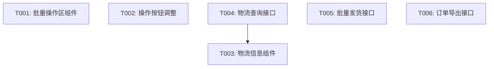

# spec Skill 详细设计方案

## 1. 概述

`spec` Skill 负责**需求理解与极细粒度拆解**，是 AI-Native 开发范式中的入口阶段（对应 Phase 1）。该 Skill 可独立使用，也可作为完整流程的第一步。

## 2. 功能定位

| 维度 | 说明 |
|------|------|
| **阶段定位** | Phase 1：需求理解与极细粒度拆解 |
| **核心职责** | 解析 PRD 和 UI，对比 Product Map，输出变更清单和 Task DAG |
| **输入来源** | PRD 文本、UI 图片（截图/Figma）、Product Map（可选） |
| **输出产物** | 变更清单、UseCase 列表、UI Element Tree、Task DAG、澄清清单 |

## 3. 输入规范

### 3.1 输入参数

| 参数名 | 类型 | 必填 | 说明 |
|--------|------|------|------|
| `prd` | String/Markdown/File | 是 | PRD 文档内容或文件路径 |
| `ui` | Image/URL/JSON | 是 | UI 设计图（图片、Figma URL 或结构化 JSON） |
| `product_map` | JSON/YAML/Directory | 否 | 现有 Product Map，用于变更分析 |
| `previous_iteration` | Directory | 否 | 上一迭代产物，用于上下文传递 |
| `output_format` | String | 否 | 输出格式：markdown / json / html（默认：markdown） |

### 3.2 输入格式示例

#### PRD 输入格式（Markdown）
```markdown
# 需求文档：订单管理模块 v2.0

## 1. 需求背景
为提升用户体验，需要优化订单管理功能，增加物流追踪和批量操作能力。

## 2. 功能需求

### 2.1 新增功能
- **订单物流追踪**：用户可查看订单的实时物流状态
- **批量发货**：支持商家批量发货操作
- **订单导出**：支持导出订单列表为 Excel

### 2.2 修改功能
- **订单详情页**：增加物流信息展示区域
- **订单列表页**：增加批量选择和操作按钮

### 2.3 删除功能
- 移除"取消订单"功能（移至售后模块）

## 3. 业务规则
- 物流信息仅对已发货订单显示
- 批量发货每次最多选择 50 个订单
- 订单导出支持按时间范围筛选
```

#### UI 输入格式（JSON，结构化标注）
```json
{
  "pages": [
    {
      "pageName": "订单列表页",
      "blocks": [
        {
          "blockName": "筛选栏",
          "fields": [
            {"name": "startDate", "label": "开始时间", "type": "date", "required": false},
            {"name": "endDate", "label": "结束时间", "type": "date", "required": false},
            {"name": "status", "label": "订单状态", "type": "select", "options": ["全部", "待支付", "已支付", "已发货", "已完成"]}
          ]
        },
        {
          "blockName": "批量操作区",
          "fields": [
            {"name": "selectAll", "label": "全选", "type": "checkbox"},
            {"name": "batchShip", "label": "批量发货", "type": "button"},
            {"name": "export", "label": "导出", "type": "button"}
          ]
        },
        {
          "blockName": "订单列表",
          "fields": [
            {"name": "orderNo", "label": "订单编号", "type": "string"},
            {"name": "customerName", "label": "客户姓名", "type": "string"},
            {"name": "totalAmount", "label": "订单金额", "type": "decimal"},
            {"name": "status", "label": "状态", "type": "enum", "options": ["待支付", "已支付", "已发货", "已完成"]},
            {"name": "createTime", "label": "创建时间", "type": "datetime"},
            {"name": "actions", "label": "操作", "type": "buttons", "options": ["详情", "发货", "取消"]}
          ]
        }
      ]
    },
    {
      "pageName": "订单详情页",
      "blocks": [
        {
          "blockName": "物流信息",
          "fields": [
            {"name": "trackingNo", "label": "运单号", "type": "string"},
            {"name": "logisticsCompany", "label": "物流公司", "type": "string"},
            {"name": "trackingStatus", "label": "物流状态", "type": "string"},
            {"name": "trackingSteps", "label": "物流轨迹", "type": "list", "items": ["时间", "地点", "状态"]}
          ]
        }
      ]
    }
  ]
}
```

## 4. 输出规范

### 4.1 输出产物清单

| 产物 | 格式 | 用途 |
|------|------|------|
| **变更清单** | Markdown | 新增/修改/删除的功能列表 |
| **UseCase 列表** | Markdown | 业务场景描述和规则 |
| **UI Element Tree** | JSON | 页面→区块→字段的层级结构 |
| **需求分解 DAG** | JSON + Mermaid | Task 依赖关系图 |
| **Ambiguity Checklist** | Markdown | 待澄清问题清单 |
| **变更前后对比表** | Markdown | 原有状态 vs 当前状态 |

### 4.2 输出格式示例

#### 变更清单输出（Markdown）
```markdown
# 变更清单

## 新增功能（3项）
1. ✅ 订单物流追踪 - 用户可查看订单的实时物流状态
2. ✅ 批量发货 - 支持商家批量发货操作（每次最多50个订单）
3. ✅ 订单导出 - 支持导出订单列表为 Excel

## 修改功能（2项）
1. ✅ 订单详情页 - 增加物流信息展示区域
2. ✅ 订单列表页 - 增加批量选择和操作按钮

## 删除功能（1项）
1. ⚠️ 取消订单 - 移至售后模块（已标记废弃）

## 业务规则变更（3条）
1. 物流信息仅对已发货订单显示
2. 批量发货每次最多选择 50 个订单
3. 订单导出支持按时间范围筛选
```

#### UseCase 列表输出（Markdown）
```markdown
# UseCase 列表

## UseCase: 查看物流信息
- **前置条件**: 订单已发货
- **主流程**: 用户进入订单详情页 → 系统展示物流信息
- **业务规则**: 物流信息仅对已发货订单显示

## UseCase: 批量发货
- **前置条件**: 商家已登录，存在待发货订单
- **主流程**: 选择订单 → 点击批量发货 → 确认发货 → 系统更新订单状态
- **业务规则**: 每次最多选择 50 个订单

## UseCase: 导出订单
- **前置条件**: 用户已登录
- **主流程**: 设置筛选条件 → 点击导出 → 系统生成 Excel 文件
- **业务规则**: 支持按时间范围筛选

## UseCase: 查看订单列表
- **前置条件**: 用户已登录
- **主流程**: 用户进入订单页面 → 设置筛选条件 → 系统返回订单列表
- **业务规则**: 支持按状态筛选
```

#### UI Element Tree 输出（JSON）
```json
{
  "pages": [
    {
      "pageName": "订单列表页",
      "changeType": "MODIFY",
      "blocks": [
        {
          "blockName": "筛选栏",
          "changeType": "EXISTING",
          "fields": [
            {"name": "startDate", "label": "开始时间", "type": "date", "required": false, "changeType": "EXISTING"},
            {"name": "endDate", "label": "结束时间", "type": "date", "required": false, "changeType": "EXISTING"},
            {"name": "status", "label": "订单状态", "type": "select", "options": ["全部", "待支付", "已支付", "已发货", "已完成"], "changeType": "EXISTING"}
          ]
        },
        {
          "blockName": "批量操作区",
          "changeType": "NEW",
          "fields": [
            {"name": "selectAll", "label": "全选", "type": "checkbox"},
            {"name": "batchShip", "label": "批量发货", "type": "button"},
            {"name": "export", "label": "导出", "type": "button"}
          ]
        },
        {
          "blockName": "订单列表",
          "changeType": "MODIFY",
          "fields": [
            {"name": "orderNo", "label": "订单编号", "type": "string", "changeType": "EXISTING"},
            {"name": "customerName", "label": "客户姓名", "type": "string", "changeType": "EXISTING"},
            {"name": "totalAmount", "label": "订单金额", "type": "decimal", "changeType": "EXISTING"},
            {"name": "status", "label": "状态", "type": "enum", "options": ["待支付", "已支付", "已发货", "已完成"], "changeType": "EXISTING"},
            {"name": "createTime", "label": "创建时间", "type": "datetime", "changeType": "EXISTING"},
            {"name": "actions", "label": "操作", "type": "buttons", "options": ["详情", "发货"], "changeType": "MODIFY", "removedOptions": ["取消"]}
          ]
        }
      ]
    },
    {
      "pageName": "订单详情页",
      "changeType": "MODIFY",
      "blocks": [
        {
          "blockName": "物流信息",
          "changeType": "NEW",
          "fields": [
            {"name": "trackingNo", "label": "运单号", "type": "string"},
            {"name": "logisticsCompany", "label": "物流公司", "type": "string"},
            {"name": "trackingStatus", "label": "物流状态", "type": "string"},
            {"name": "trackingSteps", "label": "物流轨迹", "type": "list"}
          ]
        }
      ]
    }
  ]
}
```

#### Task DAG 输出（JSON + Mermaid）
```json
{
  "tasks": [
    {
      "id": "T001",
      "name": "订单列表页 - 批量操作区组件开发",
      "type": "FEATURE",
      "changeType": "NEW",
      "dependencies": [],
      "estimatedHours": 2
    },
    {
      "id": "T002",
      "name": "订单列表页 - 操作按钮调整",
      "type": "FEATURE",
      "changeType": "MODIFY",
      "dependencies": [],
      "estimatedHours": 1
    },
    {
      "id": "T003",
      "name": "订单详情页 - 物流信息组件开发",
      "type": "FEATURE",
      "changeType": "NEW",
      "dependencies": ["T004"],
      "estimatedHours": 3
    },
    {
      "id": "T004",
      "name": "物流查询接口开发",
      "type": "API",
      "changeType": "NEW",
      "dependencies": [],
      "estimatedHours": 4
    },
    {
      "id": "T005",
      "name": "批量发货接口开发",
      "type": "API",
      "changeType": "NEW",
      "dependencies": [],
      "estimatedHours": 3
    },
    {
      "id": "T006",
      "name": "订单导出接口开发",
      "type": "API",
      "changeType": "NEW",
      "dependencies": [],
      "estimatedHours": 2
    }
  ]
}
```



#### Ambiguity Checklist 输出（Markdown）
```markdown
# 待澄清问题清单

## 必答问题（需要确认）

### 业务规则
1. **物流信息来源**：物流信息是调用第三方接口还是手动录入？
   - ▢ 第三方接口（如顺丰、圆通等）
   - ▢ 商家手动录入
   - ▢ 两者都支持

2. **批量发货限制**：50 个订单的限制是否可以配置？
   - ▢ 是（可配置）
   - ▢ 否（固定值）

### UI 设计
3. **物流轨迹展示**：物流轨迹是用时间线展示还是卡片列表？
   - ▢ 时间线
   - ▢ 卡片列表

4. **导出格式**：订单导出除了 Excel，是否需要支持其他格式？
   - ▢ 仅 Excel
   - ▢ Excel + CSV
   - ▢ Excel + CSV + PDF

### 数据迁移
5. **历史订单物流**：历史已发货订单是否需要补录物流信息？
   - ▢ 是（需要补录）
   - ▢ 否（仅新订单）
   - ▢ 可选（商家自行决定）

## 参考信息（供确认）

- 当前系统已有订单状态：待支付、已支付、已发货、已完成
- 当前系统支持的支付方式：微信支付、支付宝
- 当前系统支持的用户角色：普通用户、商家、管理员
```

#### 变更前后对比表（Markdown）
```markdown
# 变更前后对比表

## 订单列表页

| 项目 | 变更前 | 变更后 | 变更类型 |
|------|--------|--------|----------|
| 批量操作 | 无 | 全选、批量发货、导出 | 新增 |
| 操作按钮 | 详情、发货、取消 | 详情、发货 | 修改（移除取消） |
| 筛选条件 | 状态、时间范围 | 状态、时间范围 | 无变化 |

## 订单详情页

| 项目 | 变更前 | 变更后 | 变更类型 |
|------|--------|--------|----------|
| 物流信息 | 无 | 运单号、物流公司、物流状态、轨迹 | 新增 |
| 订单信息 | 基本信息、商品列表 | 基本信息、商品列表、物流信息 | 修改 |

## 业务规则

| 规则 | 变更前 | 变更后 | 变更类型 |
|------|--------|--------|----------|
| 取消订单 | 订单列表页操作 | 移至售后模块 | 删除 |
| 批量操作限制 | 无 | 每次最多50个订单 | 新增 |
| 订单导出 | 无 | 支持按时间范围筛选导出 | 新增 |
```

## 5. 核心处理流程

```
┌─────────────────────────────────────────────────────────────────┐
│                         spec Skill                             │
├─────────────────────────────────────────────────────────────────┤
│  Step 1: Product Map 完整性校验                                 │
│    ├── 检查 Product Map 结构完整性                               │
│    ├── 验证页面/接口/实体定义是否完整                            │
│    └── 输出校验报告                                             │
├─────────────────────────────────────────────────────────────────┤
│  Step 2: PRD 解析                                              │
│    ├── 提取功能需求（新增/修改/删除）                            │
│    ├── 提取业务规则                                             │
│    └── 提取数据需求                                             │
├─────────────────────────────────────────────────────────────────┤
│  Step 3: UI 解析                                               │
│    ├── 图片解析（VLM）或结构化 JSON 解析                          │
│    ├── 提取页面→区块→字段层级结构                                │
│    └── 标注字段类型和约束                                        │
├─────────────────────────────────────────────────────────────────┤
│  Step 4: 变更分析                                              │
│    ├── 对比 Product Map，识别变更类型                            │
│    ├── 生成变更清单                                             │
│    └── 生成变更前后对比表                                        │
├─────────────────────────────────────────────────────────────────┤
│  Step 5: UseCase 提取                                          │
│    ├── 从 PRD 和 UI 中提取 UseCase                               │
│    ├── 定义前置条件、主流程、业务规则                            │
│    └── 生成 UseCase 列表                                        │
├─────────────────────────────────────────────────────────────────┤
│  Step 6: 需求分解（Task DAG）                                   │
│    ├── 将功能需求拆解为极小粒度 Task                             │
│    ├── 建立 Task 依赖关系                                       │
│    ├── 估算每个 Task 的工作量                                    │
│    └── 生成 Task DAG                                            │
├─────────────────────────────────────────────────────────────────┤
│  Step 7: 主动澄清                                               │
│    ├── 识别模糊点和待确认项                                     │
│    ├── 生成澄清问题清单（选择题形式）                             │
│    └── 输出 Ambiguity Checklist                                 │
├─────────────────────────────────────────────────────────────────┤
│  Step 8: 输出                                                   │
│    ├── 变更清单（Markdown）                                      │
│    ├── UseCase 列表（Markdown）                                  │
│    ├── UI Element Tree（JSON）                                   │
│    ├── Task DAG（JSON + Mermaid）                                │
│    ├── Ambiguity Checklist（Markdown）                           │
│    └── 变更前后对比表（Markdown）                                 │
└─────────────────────────────────────────────────────────────────┘
```

## 6. 核心算法与规则

### 6.1 PRD 解析规则

| 规则类型 | 规则描述 | 示例 |
|----------|----------|------|
| **功能识别** | 识别"新增"、"修改"、"删除"等关键词 | "新增功能：订单物流追踪" |
| **业务规则提取** | 识别"必须"、"仅"、"最多"、"支持"等约束词 | "每次最多选择 50 个订单" |
| **页面关联** | 根据上下文关联功能到具体页面 | "订单详情页增加物流信息" |

### 6.2 UI 解析规则

| 规则类型 | 规则描述 |
|----------|----------|
| **字段类型推断** | 根据标签推断字段类型（如"时间"→datetime，"金额"→decimal） |
| **必填推断** | 根据业务逻辑推断必填性（如订单编号→必填） |
| **枚举值提取** | 从选项列表提取枚举值 |
| **变更类型标记** | 对比 Product Map 标记新增/修改/删除 |

### 6.3 需求分解规则

| 规则类型 | 规则描述 |
|----------|----------|
| **粒度控制** | 每个 Task 不超过 4 小时工作量 |
| **原子性** | Task 必须是可独立验收的最小功能单元 |
| **依赖分析** | 根据功能依赖关系建立 DAG |
| **类型分类** | Task 类型：FEATURE（功能）、API（接口）、BUG（修复）、REFACTOR（重构） |

### 6.4 主动澄清规则

| 触发条件 | 澄清问题类型 |
|----------|--------------|
| PRD 描述模糊 | 业务规则澄清 |
| UI 细节缺失 | UI 设计澄清 |
| 数据来源不明确 | 数据来源澄清 |
| 历史数据处理 | 数据迁移澄清 |
| 第三方依赖 | 集成方案澄清 |

## 7. 调用方式

### 7.1 命令行调用
```bash
# 基础调用
spec \
  --prd="prd.md" \
  --ui="ui.json" \
  --output="./output"

# 带 Product Map 的变更分析
spec \
  --prd="prd.md" \
  --ui="design.png" \
  --product_map="./product-map/" \
  --previous_iteration="./iterations/v1.0/" \
  --output_format="markdown" \
  --output="./output"
```

### 7.2 API 调用
```json
POST /api/spec
Content-Type: application/json

{
  "prd": "# 需求文档...",
  "ui": {"pages": [...]},
  "product_map": {...},
  "previous_iteration": "./iterations/v1.0/",
  "output_format": "markdown"
}
```

### 7.3 Skill 调用（Cursor/Trae）
```
/spec --prd="需求文档.md" --ui="设计稿.png" --product-map="./product-map"
```

## 8. 错误处理

### 8.1 输入验证错误

| 错误类型 | 错误码 | 错误消息 |
|----------|--------|----------|
| 缺少必填参数 | 400 | "缺少必填参数：prd 或 ui" |
| PRD 格式错误 | 400 | "PRD 格式不正确，请使用 Markdown 格式" |
| UI 解析失败 | 400 | "UI 解析失败：{具体错误}" |
| Product Map 解析失败 | 400 | "Product Map 解析失败：{具体错误}" |

### 8.2 业务逻辑错误

| 错误类型 | 错误码 | 错误消息 |
|----------|--------|----------|
| 需求过于模糊 | 400 | "PRD 描述过于模糊，请提供更详细的需求说明" |
| 冲突检测 | 400 | "检测到需求冲突：{描述}" |
| 无法识别的功能 | 400 | "无法识别以下功能：{功能列表}" |

### 8.3 输出降级策略

当发生非致命错误时：
1. 生成部分结果（可能不完整）
2. 在澄清清单中标记 WARNING
3. 提供人工审查建议

## 9. 扩展点

### 9.1 可扩展组件

| 扩展点 | 说明 | 扩展方式 |
|--------|------|----------|
| **PRD 解析器** | 支持不同格式的 PRD | 新增 Parser 实现 |
| **UI 解析器** | 支持不同的 UI 来源 | 新增 Parser 实现（如 Figma API） |
| **澄清策略** | 自定义澄清规则 | 新增 Clarifier 实现 |
| **Task 估算** | 自定义工作量估算规则 | 新增 Estimator 实现 |

### 9.2 插件机制

```
spec/
├── core/           # 核心逻辑
├── parsers/        # 解析器插件
│   ├── prd/        # PRD 解析器
│   └── ui/         # UI 解析器
├── clarifiers/     # 澄清策略插件
└── estimators/     # 估算策略插件
```

## 10. 性能考虑

### 10.1 处理规模
- 支持最大：100 页 PRD + 10 个 UI 设计图
- 处理时间：< 30 秒（常规场景）

### 10.2 缓存策略
- 缓存 Product Map 解析结果
- 缓存 PRD 解析规则

## 11. 安全考虑

| 安全风险 | 应对策略 |
|----------|----------|
| 输入注入 | 参数化处理，禁止执行用户输入的代码 |
| 敏感信息泄露 | 输出前脱敏处理 |
| 资源耗尽 | 限制输入大小（最大 10MB） |
| 图片安全 | 限制图片大小和格式，检测恶意图片 |

---

## 附录：输出文件清单

| 文件 | 路径 | 说明 |
|------|------|------|
| 变更清单 | `output/changelog.md` | Markdown 格式的变更说明 |
| UseCase 列表 | `output/usecase.md` | Markdown 格式的 UseCase 文档 |
| UI Element Tree | `output/ui-elements.json` | JSON 格式的 UI 元素结构 |
| Task DAG | `output/task-dag.json` | JSON 格式的任务依赖图 |
| Task DAG 图 | `output/task-dag.mmd` | Mermaid 格式的任务依赖图 |
| 澄清清单 | `output/ambiguity.md` | Markdown 格式的待澄清问题 |
| 变更对比表 | `output/change-comparison.md` | Markdown 格式的变更前后对比 |
| 校验报告 | `output/validation-report.json` | JSON 格式的 Product Map 校验结果 |